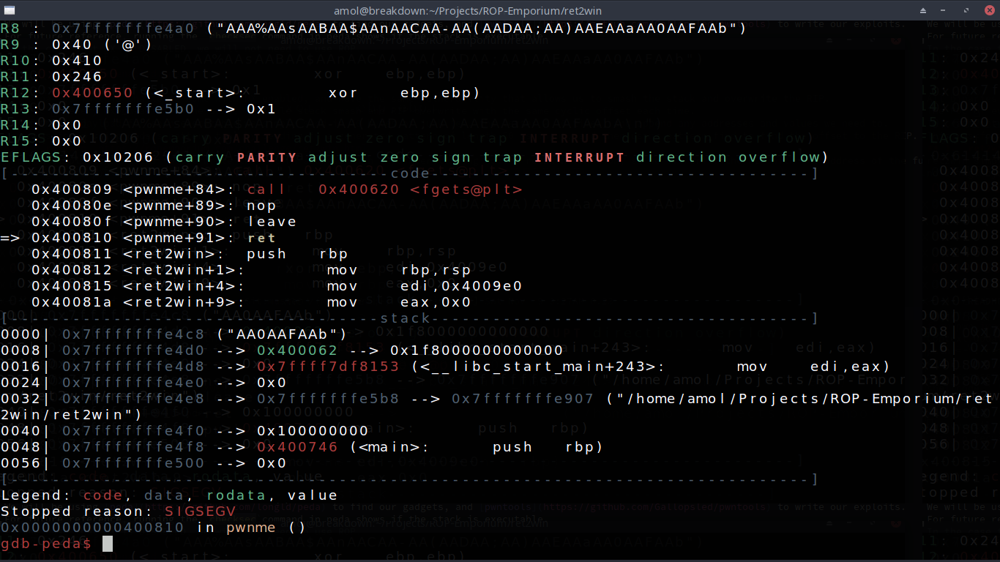
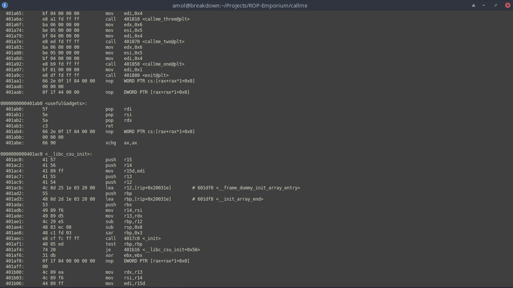
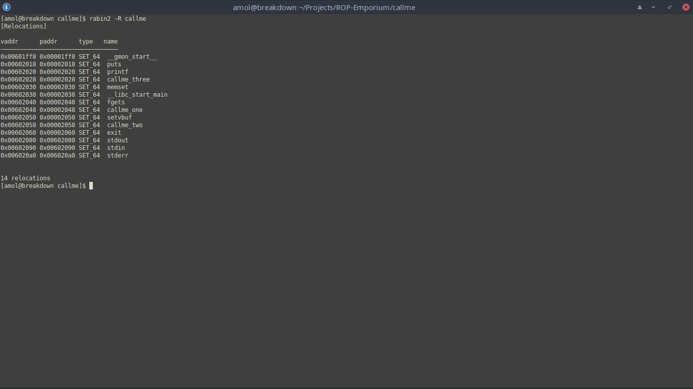
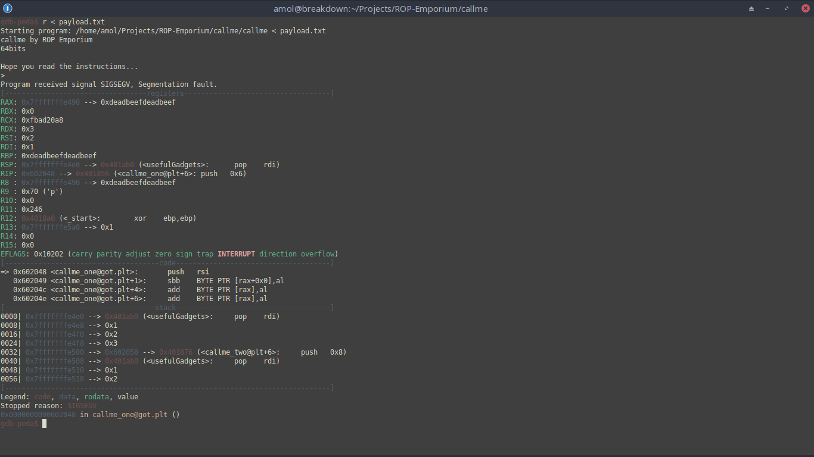

# ROP-Emporium
Written reports detaling the solution to each 64-bit challenge at ropemporium.com
We will be using [peda](https://github.com/longld/peda) to find our gadgets, and [pwntools](https://github.com/Gallopsled/pwntools) to write our exploits.
For future reference, running the `checksec`command in peda shows if the stack is executable.
In the case that NX is DISABLED, we will not need to use ROP.

All binaries in this challenge come with NX enabled, and have the same vulnerability that allows us to smash the stack and overwrite the RIP.
The POC of every executable is the same, a simple stack smash and RIP overwrite with the same cyclic offset each time.
To craft out payload for each executable we simply send in 40 bytes of junk (ex. the letter A 40 times) and append any addresses and values we need to.
This was found using peda's pattern tool by sending in a generated pattern of length 50 as input (`pattern create 50`), and then using `pattern search` to find the offset to the RSP.

## 1. [ret2win](https://ropemporium.com/challenge/ret2win.html)
ret2win simply requires us to overwrite the return address with a pointer leading to the ret2win function, so we overwrite the RIP with the address of the function (found using objdump)

## 2. [split](https://ropemporium.com/challenge/split.html)
As mentioned on the challenge page, we will start off by listing the strings in the .data sections of the split binary by using`rabin2 -z split`.

If we look *really* carefully, we can see a string that looks like a command that writes out the contents of the flag file, namely the string `/bin/cat flag.txt`.
We'll note down the address of this string, since we'll probably be using it later.
Next up we look for anything in the assembly that looks like it could use this string as an argument, so to do that we'll dump it using `objdump -M intel -d split`.
Note that we use intel syntax, since at&t is for those who haven't ever used or heard of intel syntax.
After skimming the output for a bit, we'll eventually find a useful function.

Now you might be wondering about what makes this function useful enough to be named "useful function".
The reason for that is the call to system() it makes.
As a reminder, the x86\_64 assembly convention states that the first (non-float) argument of a function is stored in rdi (more info [here](https://en.wikipedia.org/wiki/X86_calling_conventions#System_V_AMD64_ABI)).
If we can somehow get the address of that string we found earlier into rdi and return to this call, we can get the binary to print out the flag.
First we see if there's a gadget that fits the decription of what we need: a pop into rdi, and then a ret.
To do this we use peda to run the binary, breaking at main to run the command `ropsearch "pop rdi; ret"`

Note down this address to use it later.
At this point we have everything we need to exploit this binary.
To note the relations between our available tools:
-- we need to pop the address of the string from the stack into rdi
-- we need to return to the call to system afterwards
So our payload will consist of the address of the gadget, followed by the address of the string, followed by the address of the system() call.
The overwritten return will go to the gadget (popping the gadget address into the RIP), then the gadget will pop the address of the string into rdi and return to the next value on the stack, which will execute system and conclude the exploit.

## 3. [callme](https://ropemporium.com/challenge/callme.html)
This challenge seems a bit different from the ones we've seen so far, but at the same time it isn't too bad once you read up on the plt.
The guts of this seem to be: load up the registers using the given gadgets, call the function, and repeat two more times.

To load the function arguments, we put the arguments we want in order on the stack and call the gadget, popping the values into the registers we need them in.
Afterwards, we get the gadget to return to the location of the function we want to call.

... and it failed. This is weird. Since it's a segfault with no strange looking values anywhere important, maybe we weren't supposed to go to the relocation address? What exactly is a relocation? It looks like I don't actually know yet.
After doing a bit more [research](https://www.technovelty.org/linux/plt-and-got-the-key-to-code-sharing-and-dynamic-libraries.html), it looks like relocations are just placeholders in a binary that point somewhere else. Looking at the instructions around the instructions pointer, I can see that the address of a relocation is the address of a function in the got.plt, lining up with our knowledge of the got.plt [being an array of function pointers](https://systemoverlord.com/2017/03/19/got-and-plt-for-pwning.html).
Putting this address in the RIP is definitely not what we want, and what we were actually looking for was the location of the function in the plt since that would lead directly to the actual function call.
We can find the addresses of our functions in the .plt by using `rabin2 -i callme`.

Replacing the redirection addresses in our exploit with these lead to a successful flag capture.

